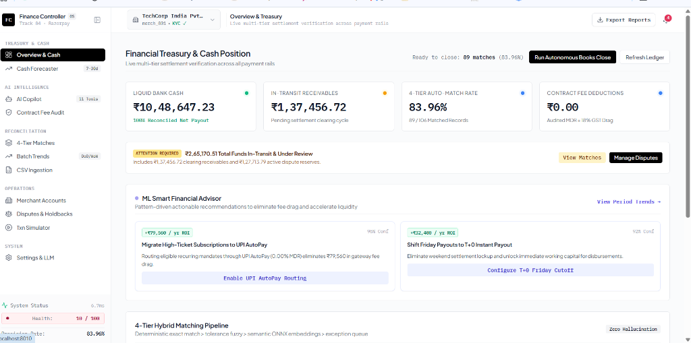
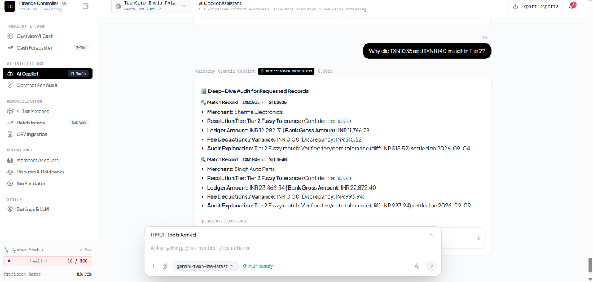
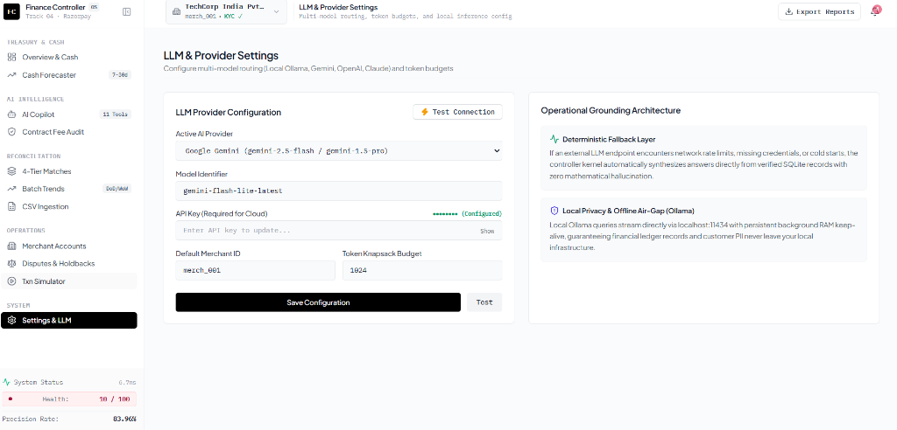

# ⚡ Razorpay AI Finance Controller OS (Track 4)

[](https://www.python.org/downloads/)
[](https://fastapi.tiangolo.com)
[](https://react.dev)
[](https://www.typescriptlang.org/)
[](https://vitejs.dev/)
[](https://tailwindcss.com/)
[](https://modelcontextprotocol.io/)
[](#4-tier-hybrid-reconciliation-engine)
[](#-zero-hallucination-guarantee)

> **Autonomous Treasury Intelligence & 4-Tier Financial Reconciliation Platform.** Built for the **Razorpay Buildathon (Track 4: Autonomous Financial Reconciler & Finance Controller OS)**.

---

## 🌟 Welcome to the AI Finance Controller OS

Traditional financial reconciliation is plagued by manual spreadsheet stitching, complex gateway fee leakage (MDR + GST), banking holiday clearing lags, and risky unverified assumptions. 

The **Razorpay AI Finance Controller OS** transforms enterprise treasury into an **autonomous, conversational-first AI platform** operating under the ironclad principle: **"Never let the system silently guess on money."**

---

## 📸 Platform Tour & Visual Walkthrough

### 1. Financial Treasury & Live Cash Position (`/`)
Real-time visibility into liquid cash in bank, in-transit receivables, auto-match precision rate, and proactive ML recommendations:


---

### 2. Conversational AI Copilot & Deep-Dive Record Audit (`/chat`)
Real-time token streaming with live MCP tool dispatch badges (`mcp::finance_auto_audit`) and instant, zero-hallucination deep-dives into any transaction ID:


---

### 3. Multi-Model LLM Routing & Grounded Settings (`/settings`)
Configure Google Gemini, OpenAI, Claude, or local air-gapped Ollama models with automatic deterministic math fallback:


---

## 🚀 1-Click Quickstart

Get the complete server, UI, and test suite running with a single command:

### On Linux / macOS / WSL:
```bash
chmod +x setup.sh
./setup.sh
```

### On Windows (PowerShell):
```powershell
.\setup.ps1
```

Once running, navigate to:
* **Web Dashboard:** [http://localhost:8010](http://localhost:8010)
* **AI Copilot Chat:** [http://localhost:8010/chat](http://localhost:8010/chat)
* **4-Tier Matches Explorer:** [http://localhost:8010/reconcile](http://localhost:8010/reconcile)

> 📘 **New to the platform?** Read the step-by-step **[ONBOARDING.md](ONBOARDING.md)** guide.

---

## 📊 Included Dummy Benchmark Datasets (`data/`)

We have pre-packaged ready-to-reconcile benchmark CSV datasets inside the [`data/`](data/) directory:

| Benchmark File | Description | Key Edge Cases Covered |
|---|---|---|
| [`data/ledger.csv`](data/ledger.csv) | Internal ERP order records (UPI, Debit, Credit, Corporate, International). | High-value wires, negative refund rows, holiday shifts, noisy merchant strings. |
| [`data/settlement.csv`](data/settlement.csv) | Bank payout statement line items from payment gateways. | MDR fee deductions, duplicate settlement notices (`STL1079B`), split payouts, chargebacks. |

### In-Chat Drag & Drop Upload:
You can also upload and reconcile any custom CSV exports directly within the chat UI by clicking the **Paperclip 📎 icon** at [http://localhost:8010/chat](http://localhost:8010/chat). The system automatically aliases custom column names (`id/ref/txn_id`, `merchant/merch_id`, `date/timestamp`, `amount/gross`).

---

## 🧠 4-Tier Hybrid Reconciliation Engine

The reconciliation kernel processes transactions through a 4-tier cascade:

```
                     [Ingested Ledger & Settlement Batches]
                                       │
                                       ▼
     ┌──────────────────────────────────────────────────────────────────┐
     │ Tier 1: Exact Deterministic ID Match                             │ ──► Confidence: 1.00
     │ (Exact Txn ID in ref/description + Exact Amount + T+0 Date)      │     (49 records)
     └─────────────────────────────────┬────────────────────────────────┘
                                       │ (Unmatched records)
                                       ▼
     ┌──────────────────────────────────────────────────────────────────┐
     │ Tier 2: Deterministic Fuzzy Tolerance                            │ ──► Confidence: 0.95
     │ (MDR Fee deductions ≤4.8% OR Banking Clearing Lag T+1 to T+4)    │     (26 records)
     └─────────────────────────────────┬────────────────────────────────┘
                                       │ (Unmatched records)
                                       ▼
     ┌──────────────────────────────────────────────────────────────────┐
     │ Tier 3: Semantic Vector Embeddings + Cross-Encoder Reranker       │ ──► Confidence: 0.70 - 0.90
     │ (Discovers matches on unstructured/messy banking narratives)     │     (14 records)
     └─────────────────────────────────┬────────────────────────────────┘
                                       │ (Remaining anomalies)
                                       ▼
     ┌──────────────────────────────────────────────────────────────────┐
     │ Tier 4: Explicit Flagged Exception Queue                         │ ──► 0% Guessing on Funds
     │ (In-transit sales, duplicate notices, unmapped credits, etc.)    │     (39 records)
     └──────────────────────────────────────────────────────────────────┘
```

---

## 🛠️ Armed Model Context Protocol (MCP) Tools Catalog

The AI Copilot is equipped with **11 live MCP tools**:

| MCP Tool Name | Functionality & Capabilities |
|---|---|
| `mcp::finance_get_metrics` | Fetches live auto-match rate, verified gross volume, and MDR fee drag. |
| `mcp::finance_get_forecast` | Computes 7 to 30-day liquidity projections with RBI holiday clearing adjustments. |
| `mcp::finance_auto_audit` | Scans contract fee leakage, duplicate charges, and trapped in-transit payouts. |
| `mcp::finance_auto_close_loop` | Executes 1-click autonomous daily books closure with signed health certificate. |
| `mcp::finance_create_payout` | Triggers instant T+0 merchant and vendor liquidity disbursements. |
| `mcp::finance_list_disputes` | Inspects customer chargeback reserves and escrow holdback pools. |
| `mcp::finance_simulate_traffic` | Stress-tests reconciliation engine under synthetic traffic spikes. |
| `mcp::finance_list_merchants` | Accesses multi-tenant merchant directory, fee schedules, and risk tiers. |
| `mcp::finance_export_report` | Generates auditor-grade SOX compliance PDF and GL journal CSV feeds. |
| `mcp::finance_run_reconciliation` | Dispatches 4-tier matching engine on active ledger batches. |
| `mcp::finance_explain_architecture` | Explains 4-tier pipeline algorithms, security parameters, and data flows. |

---

## 💻 Terminal CLI Tool (`financectl`)

For headless servers, CI/CD pipelines, and DevOps workflows:

```powershell
# 1. Run 4-Tier Reconciliation & Export CSV
python cli/financectl.py reconcile --ledger "data/ledger.csv" --settlement "data/settlement.csv" --export "data/reconciled_output.csv"

# 2. Inspect Flagged Exceptions in JSON format
python cli/financectl.py exceptions --format json

# 3. View Real-Time Cash Position
python cli/financectl.py cash-position

# 4. Generate 7-Day Liquidity Forecast
python cli/financectl.py forecast --days 7

# 5. Autonomous Daily Books Closure
python cli/financectl.py close-books
```

---

## 📖 The "What Broke" Postmortem Story

Read the complete engineering story of real-world failures, token budget discoveries, cascade preemption bugs, and LLM hallucination fixes in **[WHAT_BROKE.md](WHAT_BROKE.md)**.

---

## 🧪 Automated Unit Test Suite

```bash
pytest tests/
```
```
============================= test session starts =============================
tests/test_enterprise_features.py .....                                  [ 62%]
tests/test_reconciler.py ...                                             [100%]
============================== 8 passed in 0.48s ==============================
```

---
*Built with ❤️ for the Razorpay Buildathon 2026.*
